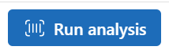

# Exercise 03: Use the Azure AI Vision and Document Playground

## Introduction

Fresenius Medicalcare is interested in evaluating solutions that extract information health insurance cards.

## Description

In this exercise, you are to leverage the Azure AI Vision and DOcument Playground to detect and extract information health infomration cards.

The key tasks are as follows:

1. Use [Azure AI Foundry](https://ai.azure.com) to access the Vision Playground:

    

2. In the Vision Playground, choose the Health Infromation Card.

Review the results in the Details section. Information should be extracted from the Health Insurance card.

## Success Criteria

* Health insurance card information is extracted and displayed in the fields section with results in json in the Results section.

## Solution

### 01: Use Azure AI Vision Playground

The Azure AI Language Playground provides a simple and interactive user interface to extract text from images using Azure AI Vision models.

Expand this section to view the solution

 Details:
    

