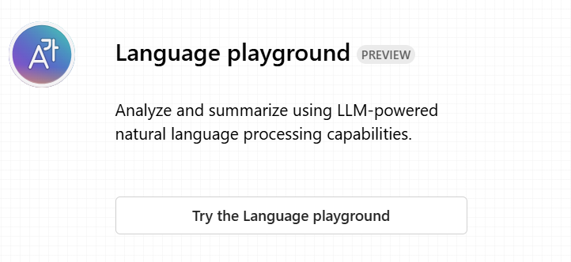
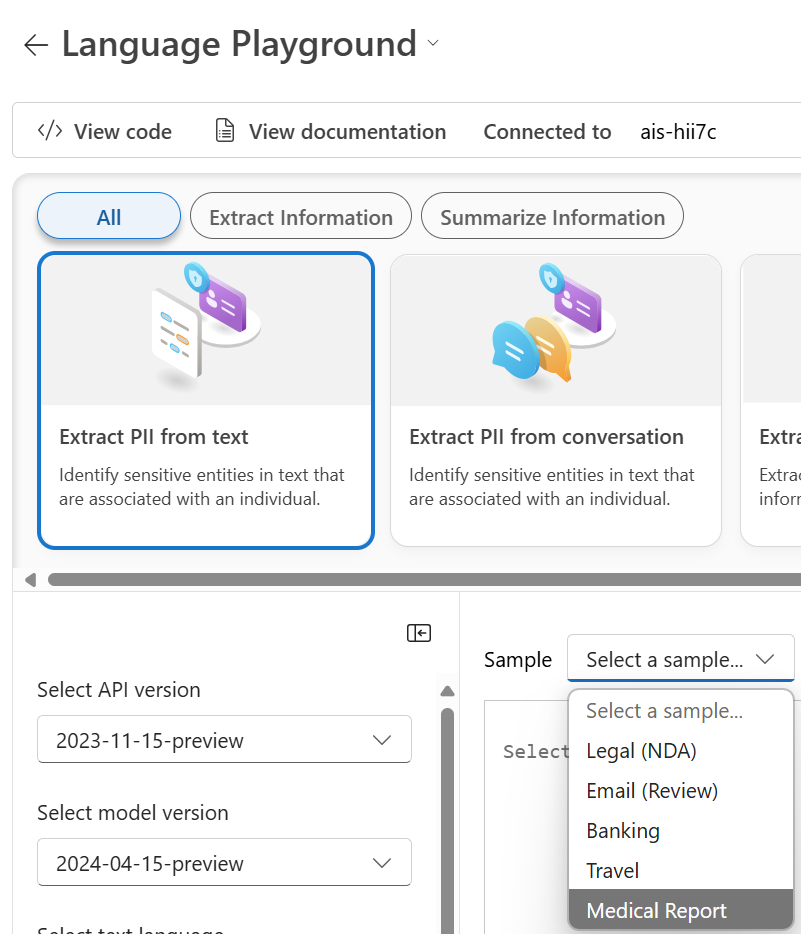
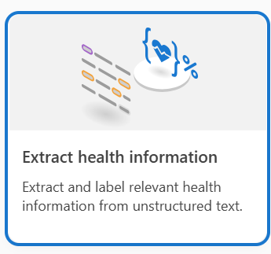
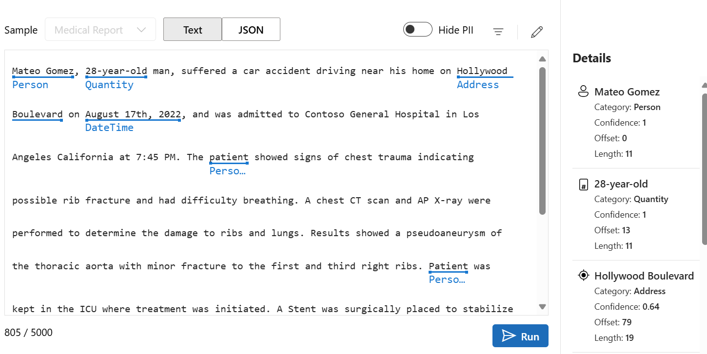
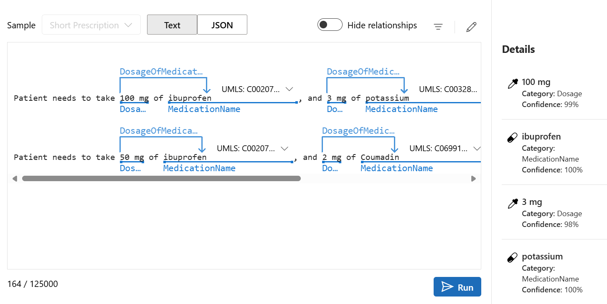

# Exercise 04: Use the Azure AI Language Playground

## Introduction

Fresenius Medicalcare is interested in evaluating solutions that detect personal identified information (PII) in text.

## Description

In this exercise, you are to leverage the Azure AI Language Playground to detect and extract PII from sample text.

The key tasks are as follows:

1. Use [Azure AI Foundry](https://ai.azure.com) to access the Language Playground:

    

2. In the Language Playground, stay on Extract PII from text and choose the Medical Report sample scroll down and press the run button at the bottom.

Review the results in the Details section. PII should be extracted and shown in the right-hand side of the screen.

3. In the Language Playground, change to Extract Health information and choose the Short Perscription sample scroll down and press the run button at the bottom.

Review the results in the Details section. Perscription informaton should be extracted and shown in the right-hand side of the screen.

## Success Criteria

* PII is displayed on the right-hand side of the screen.
* Perscription information is displayed on the right-hand side of the screen.

## Solution

### 01: Use Azure AI Language Playground

The Azure AI Language Playground provides a simple and interactive user interface to test and experiment with deployed Azure AI Language models.

Expand this section to view the solution

 Details:
    

 Details:
    

