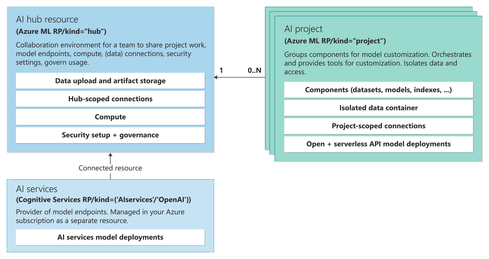

# Operationalizing Language and Vision Models

In this workshop, you may gain an overview of how to use Azure AI to work with language models (LMs) and Vision Models (VMs). This workshop aims to familiarize the team with the basics of Azure AI services to spark ideas on how they can be leveraged to meet your use cases.

The focus will be on understanding the overall process of creating, evaluating, and deploying LMs and VMs within your Azure environment. This foundational knowledge may be crucial if you decide to delve deeper into the build, evaluation, deployment, and monitoring processes in subsequent workshops.

By the end of this workshop, you as part of the Fresenius Medicalcare team will have a solid understanding of the basic tools and services available in Azure AI Foundry.

## Objectives

After you complete this workshop, you will be able to:

* Bootstrap your project.
* Use Azure AI Chat Playground.
* Test chat for Content Safety in Azure AI Chat Playground.
* Use Azure AI Vision Playground.
* Use Azure AI Language Playground.

Index of key Concepts of Azure AI Foundry

## Azure AI Resource  
   
The Azure AI Resource is the main Azure resource for AI Foundry. It provides a working environment for teams to build and manage AI applications. It allows access to multiple Azure AI services in a single setup and includes features for billing, security configuration, and monitoring.  
   
## Azure AI projects  
   
Azure AI projects are organizational containers that provide tools for AI customization and orchestration. They allow you to organize your work, save state across different tools (such as prompt flow), and collaborate with others. Projects also help you keep track of billing, manage access, and provide data isolation.  
   
## Azure AI Service  
   
The Azure AI Service offers a unified endpoint and API Keys to access multiple services, such as Azure Content Safety, Speech, and Vision. These services are shared across all projects, providing a centralized and efficient way to access them.
   
## Storage Account  
   
The Storage Account stores artifacts for your projects, such as flows and evaluations. To ensure data isolation, storage containers are prefixed using the project GUID, and they are conditionally secured for the project identity.  
   
## Key Vault  
   
The Key Vault is used to store secrets, such as connection strings for your resource connections. To maintain data isolation, secrets cannot be retrieved across projects via APIs, ensuring the security of your sensitive information.  
   
## Container Registry  
   
The Container Registry stores Docker images that are created when using the custom runtime for prompt flow. To ensure data isolation, Docker images are prefixed using the project GUID, allowing for easy identification and management.  
   
## Application Insights  
   
Application Insights is used as a log storage option when you choose to enable application-level logging for your deployed prompt flows. It provides a centralized location to store and analyze logs for monitoring and troubleshooting purposes.  
   
## Log Analytics Workspaces  
   
Log Analytics Workspaces serve as the backing storage for application insights, handling log ingestion. They provide a scalable and reliable solution for storing and analyzing log data from your AI applications.

## Azure services and related products

The following Azure Services are involved in the workshop:
- Azure AI Foundry
- Azure AI Services
- Azure Content Safety

## Solution architecture

The architecture of this workshop includes an AI project within Azure AI Foundry. The AI Foundry Hub includes the Azure Subcription, Resource Group, and Azure Content Safety service. The AI Foundry Hub provides integration with AI services, and Azure Storage Accounts to implement AI-based solutions. The Chat Playground offers tools like Chat Playground, Deployments, and Prompt Flow, that enable quick and easy access to AI models such as GPT-4o, PHI-3 and interactive development tools.

The following diagram shows Azure AI Foundry and the scope of use within the environment:

## Prerequisites

An Azure (external) subscription is required, where you can create an AI Project along with its AI Hub Resource, a Content Safety service, a new instance of Azure Service.

## Setup

To setup for this workshop, please click to access the setup instructions here:

[Link to Setup](01_setup.md)

## Lab Duration

* **Estimated Time:** 60 minutes

## Exercises

This workshop covers the following:

* Configuring and setting up Azure AI Foundry Project
* Chatting with your data using the Chat Playground
* Testing chat interactions for Content Safety
* Extracting health insurance card information from a picture
* Extracting PII from text using using the Language Playground

Here are links to the exercises that are included in this workshop:

[Use the Azure AI Chat Playground](01_01.md)

[Test language model prompts for Content Safety in the Azure AI Chat Playground](01_02.md)

[Use the Azure AI Vision & Document Playground](01_03.md)

[Use the Azure AI Language Playground](01_4.md)